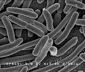

::::::::::::::::::::::::::::::::::::::: objectives

- Why study *E. coli*?
- Understand the data set.
- What is hypermutability?

::::::::::::::::::::::::::::::::::::::::::::::::::

:::::::::::::::::::::::::::::::::::::::: questions

- What data are we using?
- Why is this experiment important?

::::::::::::::::::::::::::::::::::::::::::::::::::

## Background

We are going to use a long-term sequencing dataset from a population of *Escherichia coli*.

- **What is *E. coli*?**
  - *E. coli* are rod-shaped bacteria that can survive under a wide variety of conditions including variable temperatures, nutrient availability, and oxygen levels. Most strains are harmless, but some are associated with food-poisoning.

{alt='Wikimedia'}

<!-- https://species.wikimedia.org/wiki/Escherichia_coli#/media/File:EscherichiaColi_NIAID.jpg -->

- **Why is *E. coli* important?**
  - *E. coli* are one of the most well-studied model organisms in science. As a single-celled organism, *E. coli* reproduces rapidly, typically doubling its population every 20 minutes, which means it can be manipulated easily in experiments. In addition, most naturally occurring strains of *E. coli* are harmless. Most importantly, the genetics of *E. coli* are fairly well understood and can be manipulated to study adaptation and evolution.

## The data

- The data we are going to use is part of a long-term evolution experiment led by [Richard Lenski](https://en.wikipedia.org/wiki/E._coli_long-term_evolution_experiment).

- The experiment was designed to assess adaptation in *E. coli*. A population was propagated for more than 40,000 generations in a glucose-limited minimal medium (in most conditions glucose is the best carbon source for *E. coli*, providing faster growth than other sugars). This medium was supplemented with citrate, which *E. coli* cannot metabolize in the aerobic conditions of the experiment. Sequencing of the populations at regular time points revealed that spontaneous citrate-using variant (**Cit+**) appeared between 31,000 and 31,500 generations, causing an increase in population size and diversity. In addition, this experiment showed hypermutability in certain regions. Hypermutability is important and can help accelerate adaptation to novel environments, but also can be selected against in well-adapted populations.

- To see a timeline of the experiment to date, check out this [figure](https://en.wikipedia.org/wiki/E._coli_long-term_evolution_experiment#/media/File:LTEE_Timeline_as_of_May_28,_2016.png), and this paper [Blount et al. 2008: Historical contingency and the evolution of a key innovation in an experimental population of *Escherichia coli*](https://www.pnas.org/content/105/23/7899).

### View the metadata

We will be working with three sample events from the **Ara-3** strain of this experiment, one from 5,000 generations, one from 15,000 generations, and one from 50,000 generations. The population changed substantially during the course of the experiment, and we will be exploring how (the evolution of a **Cit+** mutant and **hypermutability**) with our variant calling workflow. The metadata file associated with this lesson can be [downloaded directly here](files/Ecoli_metadata_composite.csv) or [viewed in Github](https://github.com/datacarpentry/wrangling-genomics/blob/main/episodes/files/Ecoli_metadata_composite.csv). If you would like to know details of how the file was created, you can look at [some notes and sources here](https://github.com/datacarpentry/wrangling-genomics/blob/main/episodes/files/Ecoli_metadata_composite_README.md).

This metadata describes information on the *Ara-3* clones and the columns represent:

| Column           | Description                                     | 
| ---------------- | ----------------------------------------------- |
| strain           | strain name                                     | 
| generation       | generation when sample frozen                   | 
| clade            | based on parsimony-based tree                   | 
| reference        | study the samples were originally sequenced for | 
| population       | ancestral population group                      | 
| mutator          | hypermutability mutant status                   | 
| facility         | facility samples were sequenced at              | 
| run              | Sequence read archive sample ID                 | 
| read\_type        | library type of reads                           | 
| read\_length      | length of reads in sample                       | 
| sequencing\_depth | depth of sequencing                             | 
| cit              | citrate-using mutant status                     | 

:::::::::::::::::::::::::::::::::::::::  challenge

### Challenge

Based on the metadata, can you answer the following questions?

1. How many different generations exist in the data?
2. How many rows and how many columns are in this data?
3. How many citrate+ mutants have been recorded in **Ara-3**?
4. How many hypermutable mutants have been recorded in **Ara-3**?

:::::::::::::::  solution

### Solution

1. 25 different generations
2. 62 rows, 12 columns
3. 10 citrate+ mutants
4. 6 hypermutable mutants

:::::::::::::::::::::::::

::::::::::::::::::::::::::::::::::::::::::::::::::

<!-- can add some additional info relevant to interplay of hypermutability and Cit+ adaptations, but keep it simple for now -->

:::::::::::::::::::::::::::::::::::::::: keypoints

- It is important to record and understand your experiment's metadata.

::::::::::::::::::::::::::::::::::::::::::::::::::

